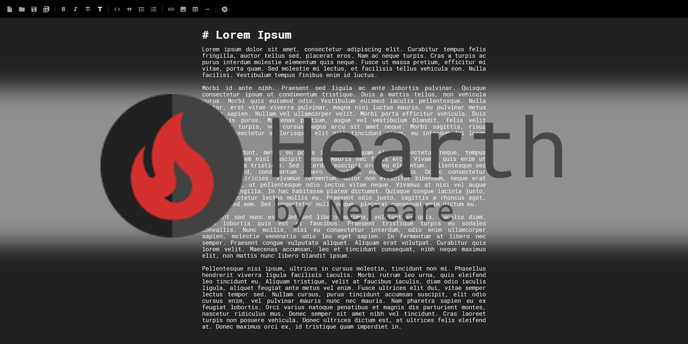

A simple writer with dynamic highlighting for Github-flavored markdown, made with [Electron](https://electronjs.org/) and :heart:.

This app offers a fullscreen scape without distractions other than the bare minimum needed to compose markdown files, with a dark interface in order to keep your eyes rested.

You may also save your texts with AES encryption in order to keep your files safe from prying eyes.

Version `0.6.0-beta` is out: [check it out!](https://github.com/Nereare/Hearth/releases/tag/v0.6.0-beta) :tada:

## Installing

Find the latest binnaries at the [Releases page](https://github.com/Nereare/Hearth/releases).

You can also get the latest version by:

1. Cloning the repository: `git clone https://github.com/Nereare/Hearth.git`;
2. Have [Node.js](https://nodejs.org/) installed;
3. Go to the folder: `cd cloned/to/folder`;
4. Get the dependencies: `npm install`;
5. Run: `npm start`.

## Code of Conduct

Please note that this project is released with a [Contributor Code of Conduct](https://github.com/nereare/Hearth/blob/master/code-of-conduct.md). By participating in this project you agree to abide by its terms.

## License

