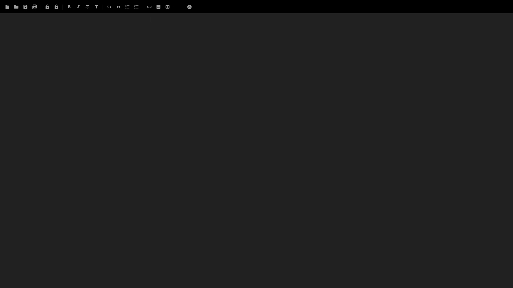
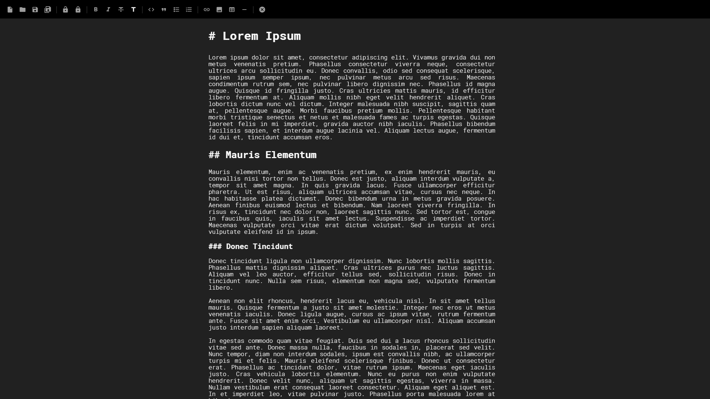
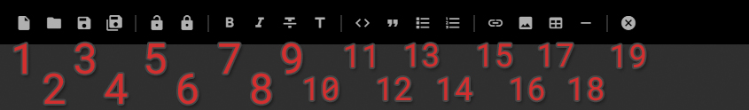

## Guide to buttons

1. New file;
2. Open file;
3. Save file;
4. Save file as;
5. Open encrypted file;
6. Save encrypted file;
7. Bold style;
8. Italic style;
9. Strikethrough style;
10. Header style;
11. Code block;
12. Quote block;
13. Unordered list element;
14. Ordered list element;
15. Link element;
16. Image element;
17. Table element;
18. Horizontal line element;
19. Quit application.
